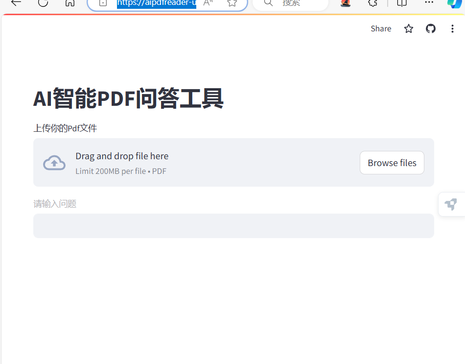

# AI智能pdf阅读器
展示链接：<a href="https://aipdfreader-uf9wmdxwd7uqej45j3ip3w.streamlit.app/">AI智能pdf阅读器</a>
仓库地址：https://github.com/Nuage123/ai_pdf_reader
## 技术栈：
开发：Python+Langchain+Streamlit
部署：Github+Streamlit cloud
## 展示：


## utils 部分代码：
```

def qa_agent(openai_api_key, memory, uploaded_file, question):
<!-- 因为无法充值openai官网的token我使用了一下代理，只要在相关网站获取token,然后修改一下base_url即可 -->
<!-- 创建ChatOpenAI模型 -->
    model = ChatOpenAI(model="gpt-3.5-turbo",
                       openai_api_key=openai_api_key,
                       base_url="https://api.openai-hub.com/v1"
                       )
     <!-- 上传文件 -->
    file_content = uploaded_file.read()
    temp_file_path = "temp.pdf"
    with open(temp_file_path, "wb") as temp_file:
        temp_file.write(file_content)
    <!-- 加载器 -->
    loader = PyPDFLoader(temp_file_path)
    docs = loader.load()
    <!-- 分片 -->
    text_splitter = RecursiveCharacterTextSplitter(
        chunk_size=1000,
        chunk_overlap=50,
        <!-- 适合中文的分隔符 -->
        separators=["\n", "。", "！", "？", "，", "、", ""]
    )
    texts = text_splitter.split_documents(docs)
    <!-- 如果没有设置虚拟环境，嵌入模型需要输入参数openai_api_key，base_url解释同上 -->
    embeddings_model = OpenAIEmbeddings(
        openai_api_key=openai_api_key,
        base_url="https://api.openai-hub.com/v1"
    )
    <!-- 数据库 -->
    db = FAISS.from_documents(texts, embeddings_model)
    <!-- 检索器 -->
    retriever = db.as_retriever()
    <!-- 链 -->
    qa = ConversationalRetrievalChain.from_llm(
        llm=model,
        retriever=retriever,
        memory=memory
    )
    <!-- 调用链 -->
    response = qa.invoke({"chat_history": memory, "question": question})
    return response
```