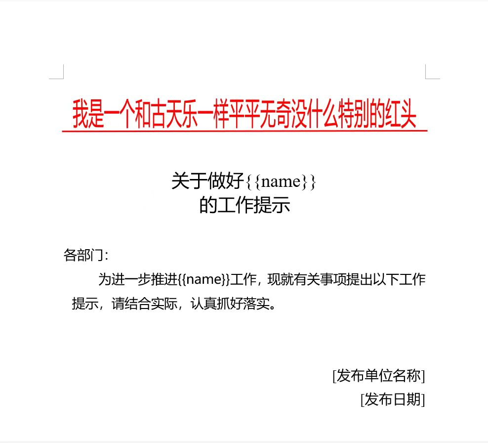
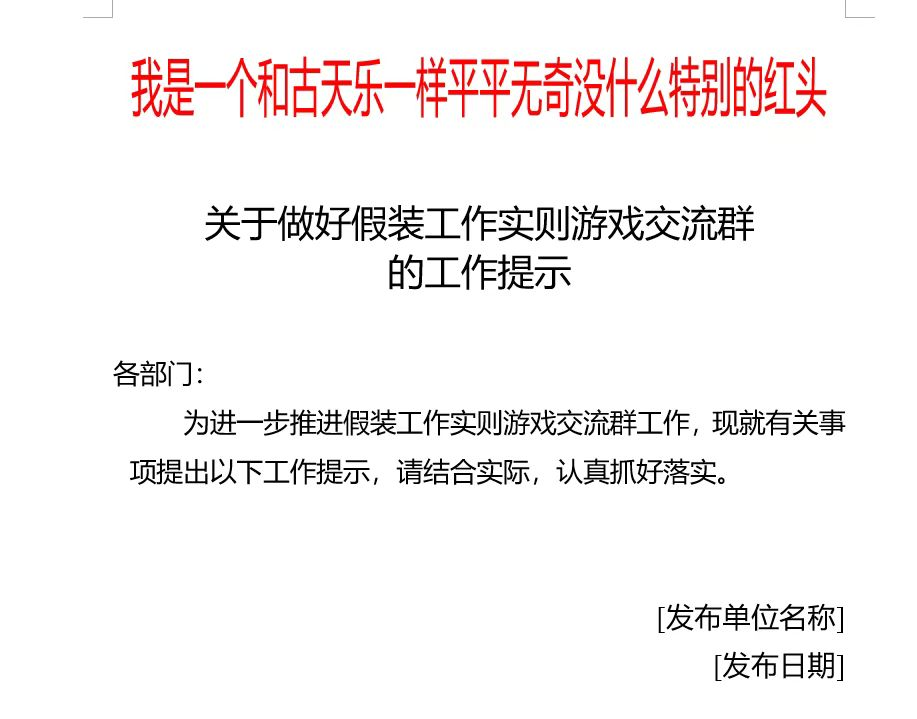
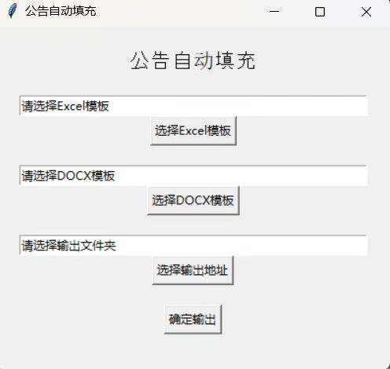

# 自动化办公工具1-Python-docx的使用（含Tkinter)

在两份offer的犹疑中，没想到自己最终选了体制内的工作，内心其实有迷惑惘然的地方，但是依然需要保持精神的尊严。
第一个月工作和想象中一样，简单但是琐碎。譬如将多份报告转换为ld期望的格式，又或者将报告第一页的留言进行修改，传统方式下会采取复制粘贴的方式。但是使用<strong>Python-Docx</strong>库可以~~轻松（因为还在学习这个库的原因，所以写脚本其实花了一点时间）~~，对word进行批量编辑，替代。效果请看最后。

## Python-docx库
### 介绍
python-docx库 是一个用于创建和更新 Microsoft Word（.docx）文件的Python库
👉<a href=https://python-docx.readthedocs.io/en/latest/index.html>Python-docx官网</a>

### 引入
```
from docx import Document
```

## Python处理word
### 打开文件
```
#path是你想编辑的文件的地址
 doc=Document(path)
```
### 存储
每次编辑结束之后记得存储word
```
doc.save(你想存储的位置)
```
### 替代制定文字
要批量撰写报告，比如批量填写公文中的事项名称。那么首先需要制作一个模板(见示例模板)。然后对制定内容进行替代。譬如，将示例模板中的{name}替代成真正的事项名称。
```
#用于替代的具体事项名称name是从excel中读取的
#读取和编辑excel需要使用Pandas库，详见下回
for paragraph in doc.paragraphs:
    for run in paragraph.runs:
        text=run.text
        if '{{name}}' in run.text:
            text = text.replace('{{name}}', name)
```
示例模板：


替换效果：


### 编辑word中的表格
在某些情况下，需要读取word中的表格数据。
#### 读取所有表格
```
 tables = doc.tables
```
#### 遍历表格
```
for i in range(1, len(tables)):
     tb = tables[i]
     #读取行
     tb_rows = tb.rows
     #获取单元格内容
     for i in range(1, len(tb_rows)):
        row_cells1 = tb_rows[i].cells：
                # 读取每一行单元格内容
                for cell in row_cells1:
                    #处理逻辑
```
### 添加内容
```
paragraph = doc.add_paragraph("你要添加到段落")
run=paragraph.add_run("你要添加到内容")
```
### 设置字体和格式
```
def setFont(run, fontName, size, bold=False):
    #字号
    run.font.size = Pt(size)
    #字体名称
    run.font.name = fontName
    #如果是中文字体需要加上这一句生效
    run._element.rPr.rFonts.set(qn('w:eastAsia'), fontName)
    #是否加粗
    run.bold=bold
```
### 删除段落或图片
有时候需要删除特定的word段落
```
def delete_paragraph(paragraph):
    p = paragraph._element
    p.getparent().remove(p)
    paragraph._p = paragraph._element = None
```
删除图片
```
#需要先确定图片的位置
para = docx1.paragraphs[1]
#删除
para.clear()
```

## TKinter
其实以上内容不用使用Tkinter，但是为了让同办公室不会代码的姐姐也能用一下这个脚本，于是我做了一个丑陋的UI界面，顺便学习一下Tkinter和exe文件打包命令。

### 引入
```
import tkinter as tk
```
### 创建窗口
```
#窗口
 window = tk.Tk()
#大小
 window.geometry("400x350")
#事件循环
window.mainloop()
```
### 组件(以按钮为例)
```
#创建按钮
button=tk.Button(window,text="点我",command=lambda:writeReport())
#放在窗口上，必须有这一步，组件才会生效    
button.pack(pady=(20, 0))
```
### Tkinter最终页面（真的超级古早风😅）：


## exe文件打包
安装Pyinstaller
```
pip install pyinstaller
```
打包命令
```
Pyinstaller -F -w -i 你的脚本.py
```
打包完成后exe文件在dist文件夹中